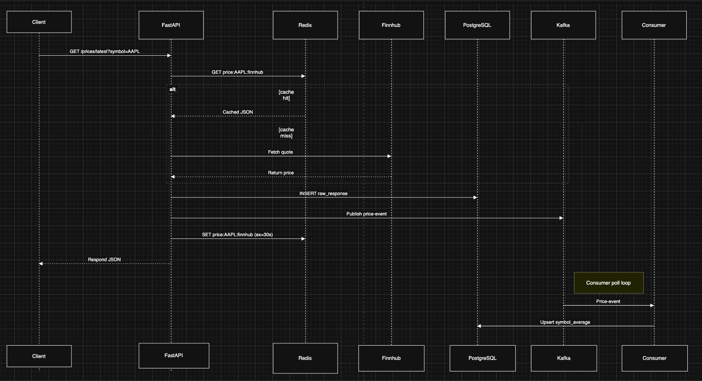

## Market Data Service

## Overview

The **Market Data Service** is a microservice designed to:

* Fetch real-time market data from Finnhub.
* Cache recent price lookups in Redis to reduce API calls.
* Publish price updates to a Kafka topic.
* Compute 5-point moving averages via a Kafka consumer.
* Persist raw and processed data in PostgreSQL.
* Manage on-demand and scheduled polling jobs.
* Expose RESTful APIs using FastAPI, with structured logging.

## Table of Contents

1. Architecture
2. Folder Structure
3. Setup Instructions
4. Running the Service
5. API Documentation
6. Testing
7. Troubleshooting
8. Future Enhancements

## Architecture

### Components

* **FastAPI App**:

  * `/prices/latest`: returns cached or freshly fetched quotes.
  * `/prices/poll`: schedules recurring polls.
* **Redis Cache**:

  * Stores price responses for 30 seconds by default to minimize external calls.
* **Finnhub Provider**: Fetches stock quotes when cache misses.
* **Kafka Producer**: Publishes price events to the `price-events` topic.
* **Kafka Consumer**:

  * Subscribes to `price-events`.
  * Calculates 5-point moving averages.
  * Writes averages back to PostgreSQL.
* **PostgreSQL**:

  * `raw_response` table for every quote.
  * `symbol_averages` table for computed moving averages.
  * `poll_jobs` table for scheduled polling configurations.
* **Scheduler**:

  * On startup, re-schedules accepted poll jobs via APScheduler.
  * Supports dynamic job creation via API.
* **Logging**:

  * Structured, leveled logs via Python’s `logging` and Uvicorn debug.

### Architecture Sequence Diagram



## Folder Structure

```
market-data-service/
├── app/
│   ├── api/             # FastAPI routes (prices.py,poll_job.py)
│   ├── core/            # Config, DI, cache setup (config.py, cache.py, dependencies.py)
│   ├── models/          # SQLAlchemy ORM models
│   ├── schemas/         # Pydantic request/response models
│   ├── services/        # Business logic (provider, producer, consumer, scheduler)
│   └── main.py          # FastAPI application entrypoint
├── tests/               # Pytest unit & integration tests
├── docker-compose.yml   # Postgres, Zookeeper, Kafka, Redis, Adminer
├── requirements.txt     # Python dependencies (including pre-commit, flake8, pytest)
└── .env                 # Environment variables
```

## Setup Instructions

1. **Clone the repo**

   ```bash
   git clone <https://github.com/pavansaipendry/Market-Data-Service.git>
   cd market-data-service
   ```

2. **Create & activate virtualenv**

   ```bash
   python3 -m venv .venv
   source .venv/bin/activate
   ```

3. **Install dependencies**

   ```bash
   pip install -r requirements.txt
   ```

4. **Configure environment variables**
   Create a `.env` file in the project root:

   ```
   FINNHUB_API_KEY=your_api_key
   DATABASE_URL=postgresql://postgres:postgres@db:5432/marketdb
   REDIS_HOST=redis
   REDIS_PORT=6379
   KAFKA_BOOTSTRAP_SERVERS=localhost:9092
   ```

## Running the Service


### Launch FastAPI app

```bash
export PYTHONPATH="${PYTHONPATH}:$(pwd)"
uvicorn app.main:app --reload --port 8000 --log-level debug
```

The API is now available at `http://localhost:8000`.

## API Documentation

### GET `/prices/latest?symbol={symbol}`

Fetch the latest (cached or live) price for a stock symbol.

* **Query Parameters**

  * `symbol` (string, required): ticker (e.g., `AAPL`, `MSFT`).
* **Response** (`200 OK`)

  ```json
  {
    "symbol": "AAPL",
    "price": 172.5,
    "timestamp": "2025-06-12T14:23:45Z",
    "provider": "finnhub"
  }
  ```
* **Errors**

  * `502 Bad Gateway`: external API failure.

### POST `/prices/poll`

Create a new polling job.

* **Request Body**

  ```json
  {
    "symbols": ["AAPL","MSFT"],
    "interval": 60,
    "provider": "finnhub"
  }
  ```
* **Response** (`202 Accepted`)

  ```json
  {
    "job_id": "uuid-string",
    "status": "accepted",
    "config": {
      "symbols": ["AAPL","MSFT"],
      "interval": 60
    }
  }
  ```

## Testing

Run all tests (unit + integration):

```bash
pytest tests/ -W ignore::DeprecationWarning
```

* **Key test modules**

  * `test_api.py`: `/prices/latest`
  * `test_poll_api.py`: `/prices/poll`
  * `test_consumer.py`: moving-average logic

* **Lint & formatting**

  ```bash
  flake8 .
  black --check .
  pre-commit run --all-files
  ```

## Troubleshooting

* **Port conflicts**

  ```bash
  lsof -i :8001
  kill -9 <PID>
  ```
* **Import errors**

  * Ensure each `app/` dir has `__init__.py`.
  * Verify `PYTHONPATH` includes project root.
* **Redis key not found**

  * Confirm host/port match your `.env`.
  * Use `redis-cli -h localhost -p 6379 -n 0 KEYS 'price:*'`.
* **Kafka topic missing**

  * Enable auto topic creation, or create `price-events` manually.

## Future Enhancements

* **Metrics & Monitoring**: Prometheus + Grafana dashboards.
* **Authentication**: API key or OAuth protection.
* **Autoscaling**: Deploy to Kubernetes or AWS ECS/Fargate.
* **Retry & backoff**: Robust error handling in the consumer.
* **API versioning**: Prepare `/v1` namespace for breaking changes.`
